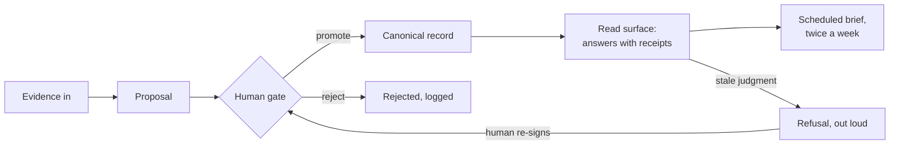

# Architecture, conceptually

This is the public shape of the system. The schema, the implementation, and the deployment details are the paid work and are not documented here. What follows is enough to evaluate the design; it is not enough to rebuild it, and that boundary is deliberate.

## The loop

Everything that becomes canonical moves through one path: proposal, then the gate. Evidence enters through its own controlled intake, because evidence is not truth and does not become canonical by arriving. When a judgment-class record goes past its freshness threshold, the read surface stops grounding answers on it and the refusal routes the record back to a human for revalidation. The loop closes through a person, on purpose.

## The parts

**The evidence corpus.** Source documents, ingested through one controlled intake, versioned by content. A changed document becomes a new version; the old version stays addressable across supersession, while retained, by an immutable identifier. Evidence is never treated as truth and is never refused for staleness, because it is the record of what existed, not a claim about what is currently true.

**The proposal path.** The only way anything approaches canonical status. The application identity can read, ingest controlled evidence, and submit proposals; it cannot promote anything and it cannot directly change canonical truth. Workflow and audit fields cannot be supplied by the proposer; the system derives them.

**The human gate.** A named person promotes or rejects every proposal. Promotion produces a commit that records the approver, the authenticated database actor, and the actual change, derived server-side from real record state rather than from what the proposer claimed. Prior state is preserved, never silently overwritten.

**Canonical records, by class.** Definitions, positioning and operating canon, dated decisions with rationale and rejected alternatives, and observed values. Each class carries the fields appropriate to it and behaves differently when old: judgment canon can refuse, operational records warn and stand, decisions remain historical, values go stale fast.

**The read surface.** A small contracted set of read functions, available to the application identity only. Answers carry class, dates, provenance, and state. Missing data comes back as honest absence, never as an invented field. If the freshness policy itself is missing or malformed, judgment grounding fails closed rather than guessing; record lookups name the policy failure alongside raw dates instead of inventing a verdict.

**The brief.** On a schedule, the layer writes its owner a short report of what exists: policy state, records needing attention, pending proposals, evidence counts, latest values. The layer speaks first; the owner does not have to remember to ask.

## The identity boundaries

Two runtime identities carry three capability boundaries. The application identity reads, ingests evidence, and proposes; it cannot promote and cannot directly change canonical truth. The gate identity promotes and rejects; it cannot read raw storage and acts through the gate functions alone. Neither can write canonical records directly. One person, the owner, stands above both with the keys.

## What this page does not contain

Table design, SQL, bucket taxonomy, threshold values in context, security configuration, connector design, or the extraction method that fills a layer with a real operator's judgment. See [verification.md](verification.md) for what was tested, and [design-decisions.md](design-decisions.md) for why the boundaries sit where they sit.
